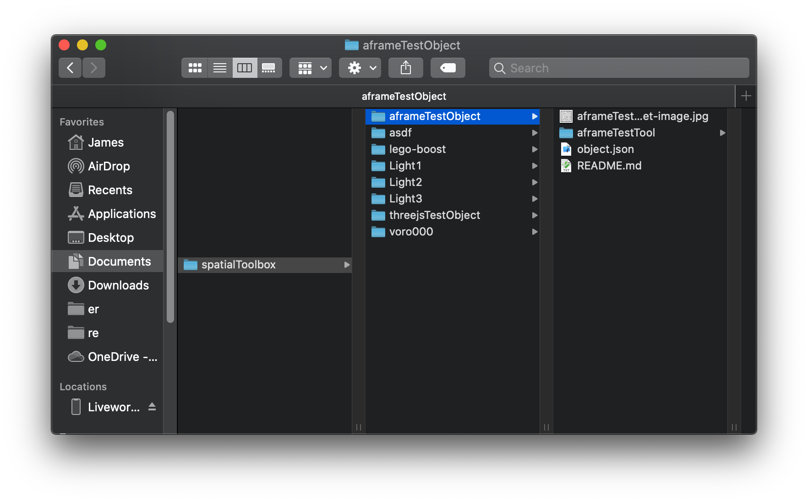

# a-frame tool example

An a-frame-based tool for the spatial toolbox. This is based on
https://spatialtoolbox.vuforia.com/docs/tutorials/three-js-tool-tutorial so
read that first if you haven't.

## Local use

Copy this folder into your spatialToolbox directory within your Documents
folder and name it aframeTestObject.

This should look like the following:

